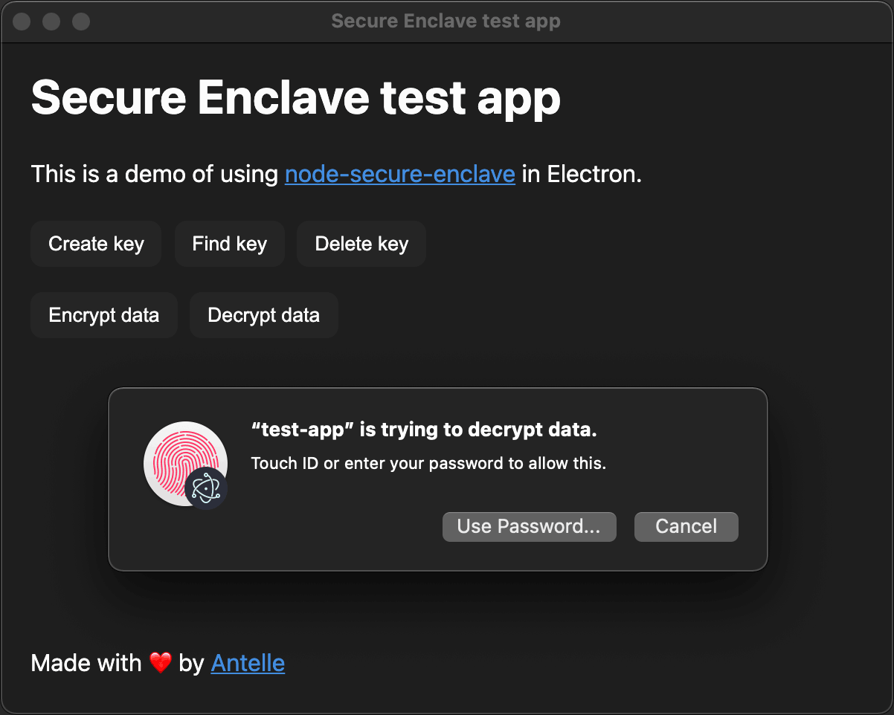

# Secure Enclave module for node.js and Electron

This module provides support for Secure Enclave operations in Electron apps.

## Demo

Download a working app here: https://github.com/antelle/node-secure-enclave/releases/latest

That's what you're expected to see:



And on your Touch Bar:


## Status

Unstable, not tested yet, I'm actively working on this project, things may break. Use at your own risk.

## Features

- no dependencies, no bloatware
- ≈50k of native code, no javascript
- works with Electron
- hardware encryption, private keys don't leak

## Requirements

Runtime:
- macOS: Secure Enclave doesn't exist on other OS
- limited to MacBooks with Touch Bar

Development:
- the app must be codesigned
- provisioning profile, see [below](#library-development)
- Xcode and command-line tools

## API

This snippet shows the basic usage:

```js
const SecureEnclave = require('secure-enclave');

if (!SecureEnclave.isSupported) {
    // Secure Enclave cannot be used on this Mac
}

const keyTag = 'your-unique-key-identifier';

const key = SecureEnclave.findKeyPair({ keyTag });
if (key) {
    // key exists, you can use key.publicKey (Buffer)
    const data = Buffer.from('something');
    // these operations return Buffer too
    data = SecureEnclave.encrypt({ keyTag, data });
    data = SecureEnclave.decrypt({ keyTag, data });
    
    // if you don't need the key anymore
    SecureEnclave.deleteKeyPair({ keyTag });
} else {
    // key doesn't exist yet
    SecureEnclave.createKeyPair({ keyTag });
}
```

Inspect [the type definition](node-secure-enclave.d.ts) for more details about the API.

## Library development

To test the app, you need a provisioning profile. Generate it on Apple Developer website and save it as `conf/test-app.provisionprofile`.

Once you have your provisioning profile and certificates installed, put your app and team id to `conf/test-app.entitlements.plist`, otherwise it won't build.  

Build everything and run the test app:
```sh
npm start
```

Generate an Xcode project for editing C++ and Objective C:
```sh
npm run generate-xcode-project
```

Run the test app:
```sh
npm run test-app
```

Run unpackaged app to iterate on UI faster (API won't work there):
```sh
npm run test-app-unpackaged
```

## Troubleshooting

There are several common errors:

```
SecKeyCreateRandomKey: A required entitlement isn't present.
```

If you got this, it means your app is not codesigned properly, in particular, a provisioning profile may be missing or bad in some form. More info in [this thread](https://developer.apple.com/forums/thread/107586).

To validate if everything is ok, run
```sh
codesign -d --entitlements :- your-app.app
```
and make sure the output contains `com.apple.application-identifier` and `com.apple.developer.team-identifier` entitlements.

## References

- https://developer.apple.com/documentation/security/certificate_key_and_trust_services/keys/storing_keys_in_the_secure_enclave
- https://github.com/atom/node-keytar/blob/master/src/keytar_mac.cc
- https://medium.com/@alx.gridnev/ios-keychain-using-secure-enclave-stored-keys-8f7c81227f4
- https://gist.github.com/microshine/8b511824d440d4792cc5114e8b92a35e
- https://developer.apple.com/forums/thread/107586

## License

[MIT](LICENSE)
